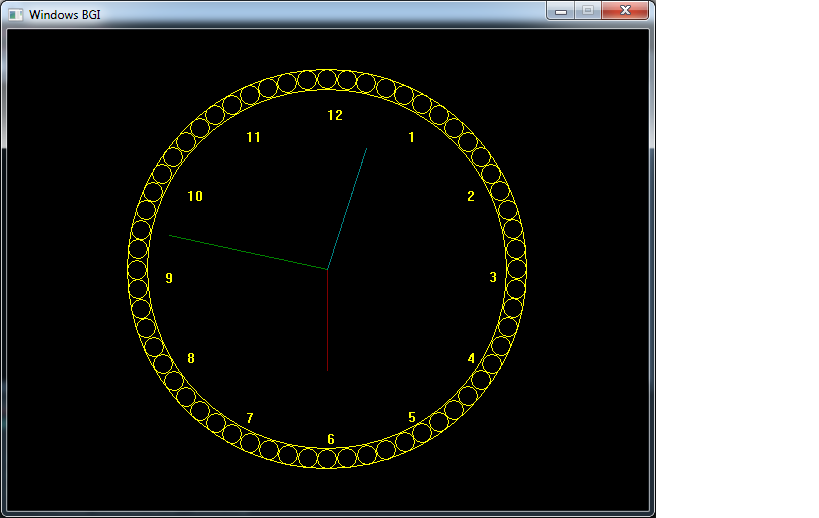
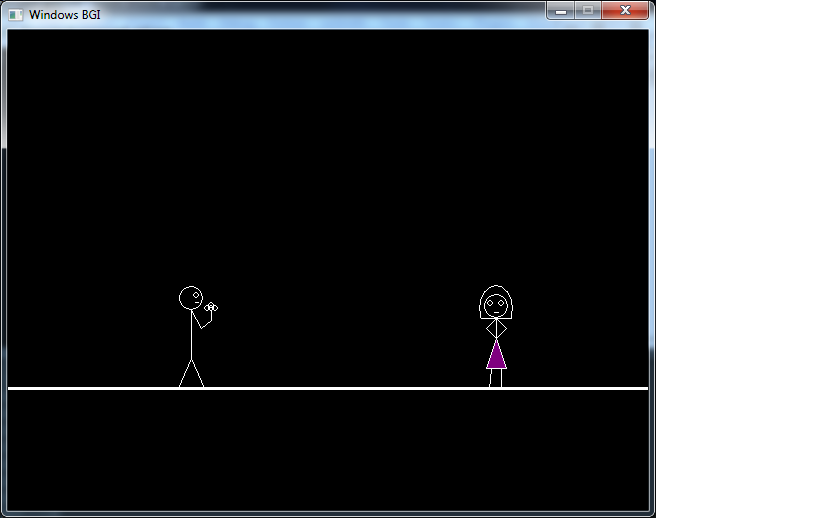
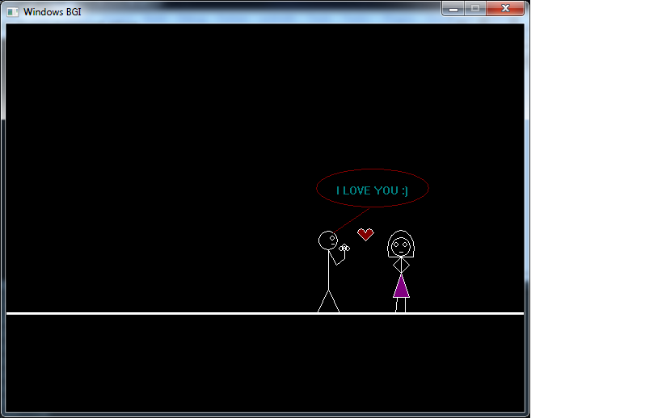

# C-CPP-Project
Here You will find some easy C and C++ project.

To Run the code you firstly need to add graphic.h header file in your compiler.
then Run the code. Else you will get compilation Error.

<h2> 1.Digital Clock </h2>

<i> when you run the program... your clock will look like this.</i> 

   
                    
  <h2 style="margin-top:600px" align="left"> 2.Analog Clock </h2>
  
<i> when you run the program... your clock will look like this.</i> 

  
   
  
                      
    <h2> 3.Propose Girls </h2>
     
    
 Here a man will walk and propose a girl 

  
                      
  
    
